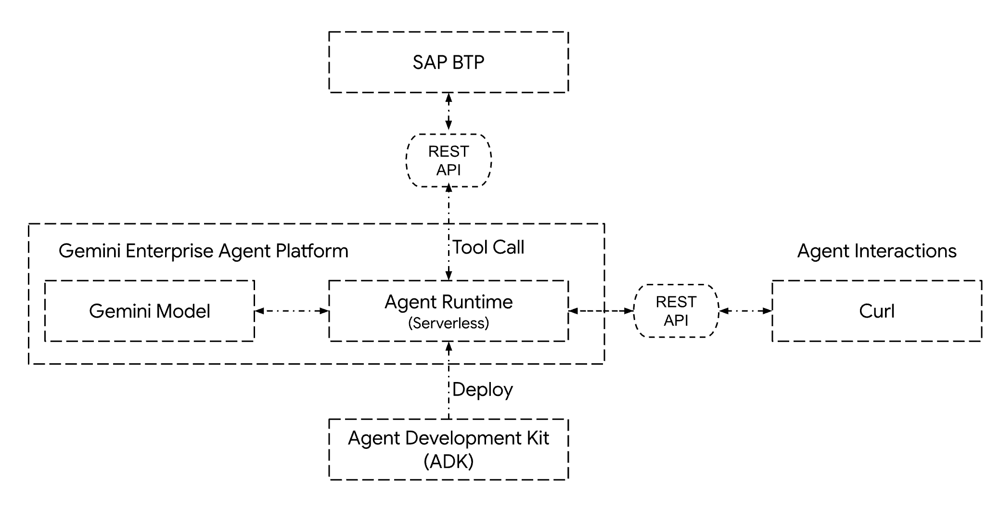
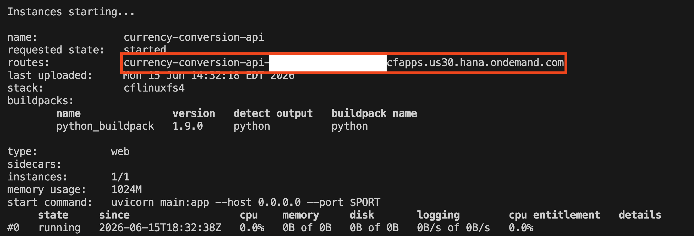
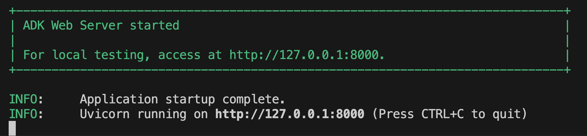
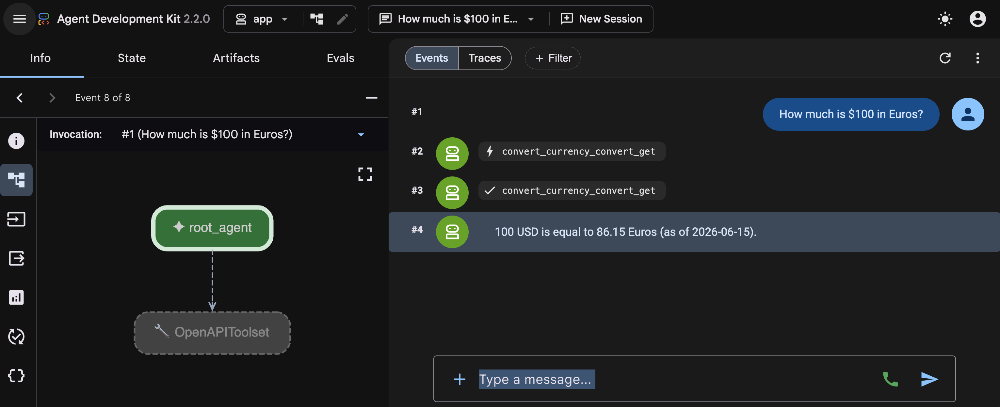
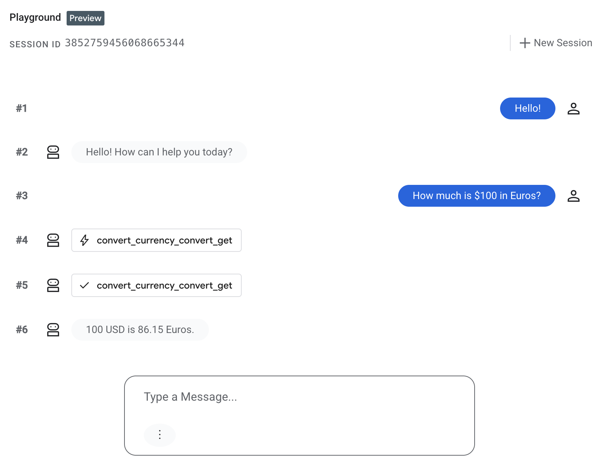

# **Tutorial: Building SAP BTP powered Agents with Google Cloud Agent Development Kit (ADK)**

**Tech Stack**: `Google Cloud ADK`, `Agent Runtime`, `Gemini`,  `SAP BTP`, `Python`  
---

# **1\. Introduction**

### **Objective**

In this tutorial, you will learn how to build an AI agent using the **Google Cloud Agent Development Kit (ADK)**. We will leverage **SAP BTP** for business logic (in this case a simple currency conversion API),  **Gemini** for serverless reasoning and deploy the final agent to the fully managed **Gemini Enterprise Agent Platform** for enterprise-grade scalability.

### **Goals**

* Build and Deploy a currency conversion REST API to **SAP BTP**  
* Initialize an agent using the **ADK Python library**  
* Implement tool calls using ADK's out of the box **OpenAPI toolset**  
* Test the agent locally using the **ADK development server**  
* Deploy the agent to **Gemini Enterprise Agent Platform** and query it via API

### **Scope**

* Single-agent orchestration using ADK.  
* Create a Python-based REST API with FastAPI running on SAP BTP  
* Consume the deployed REST API from the ADK agent using ADK's out of the box OpenAPI toolset  
* Deployment to Agent Engine (serverless) runtime

### **Out of Scope**

* Building a custom frontend UI.  
* Securing the currency conversion API with a BTP XSUAA service instance (will be covered in subsequent tutorials).  
* Complex SAP BTP service integrations  
* Complex multi-model orchestration or multi-Agent delegation (A2A protocol)

## **2\. Prerequisites & Setup**

Before you begin, ensure you have the following:

### **Google Cloud Resources**

* A [**Google Cloud Project**](https://console.cloud.google.com/projectselector2/home/dashboard) with [billing](https://docs.cloud.google.com/billing/docs/how-to/verify-billing-enabled#confirm_billing_is_enabled_on_a_project) enabled.  
* Enabled APIs:
  * [**Gemini Enterprise Agents Platform API**](https://console.cloud.google.com/flows/enableapi?apiid=aiplatform.googleapis.com)   
  * [**Compute Engine API**](https://console.cloud.google.com/flows/enableapi?apiid=compute.googleapis.com)  
  * [**Resource Manager API**](https://console.cloud.google.com/flows/enableapi?apiid=cloudresourcemanager.googleapis.com)

### **SAP BTP Resources**

* A [**SAP BTP Account**](https://account.hana.ondemand.com/)  
* The [**Cloud Foundry Environment**](https://help.sap.com/docs/SAP_CLOUD_PLATFORM/65de2977205c403bbc107264b8eccf4b/a4d3dd7482de4089b6572a63753d0434.html) enabled in your sub account.  
* A [**Space**](https://help.sap.com/docs/SAP_CLOUD_PLATFORM/65de2977205c403bbc107264b8eccf4b/1a2f6431947846c0a0f95c47a2aca0bd.html) created in your Cloud Foundry organization.

### **Local Development Environment**

* **uv** [installed](https://docs.astral.sh/uv/getting-started/installation/) and Python 3.10+ [installed using uv](https://docs.astral.sh/uv/guides/install-python/)  
* **gcloud CLI** [installed](https://docs.cloud.google.com/sdk/docs/install-sdk) and [authenticated](https://docs.cloud.google.com/sdk/docs/install-sdk#initializing-the-cli).  
* agents-cli [installed](https://google.github.io/agents-cli/)


## **3\. Architecture Overview**

The architecture follows a "Brain-Tools-Runtime" pattern.

1. **The Brain:** Gemini provides high-reasoning capabilities.  
2. **The Tool**: A FastAPI application provides a simple REST endpoint for currency conversion. It runs within the SAP BTP Cloud Foundry runtime   
3. **The Orchestrator:** ADK manages the conversation state and tool execution. It also provides a dev-ui for rapid local testing  
4. **The Runtime:** Agent Runtime hosts the code as a serverless container and an API end-point for the agent



## **4\. Building the Agent**

### **Step 1: Create the currency conversion API**

```shell
# Create a folder for hosting all the source code files for the BTP API
uv init adk-btp-simple-api
cd adk-btp-simple-api
uv add fastapi uvicorn requests cfenv sap-xssec
```

Open the main.py file in the ‘adk-btp-simple-api’ folder and paste the code below. We will use the open source [Frankfurter currency data API](https://frankfurter.dev/) to get the currency exchange rates.

```py
from fastapi import FastAPI, HTTPException, Query, Request
from fastapi.openapi.utils import get_openapi
from fastapi.responses import JSONResponse
from fastapi.middleware.cors import CORSMiddleware
import requests

# ----------------------------------------------------- #
# API Server
# ----------------------------------------------------- #
app = FastAPI(
    title="Currency Conversion API",
    description="A simple API for getting currency conversions using the Frankfurter API.",
    version="1.0.0"
)

app.add_middleware(
    CORSMiddleware,
    allow_origins=['*'], # Disable this in production
    allow_credentials=True,
    allow_methods=["*"],
    allow_headers=["*"],
)

FRANKFURTER_API_URL = "https://api.frankfurter.app/latest"

# ----------------------------------------------------- #
# OpenAPI spec endpoint
# ----------------------------------------------------- #
@app.get("/apispec.json",  include_in_schema=False)
async def get_open_api_endpoint(request: Request):
    base_url = str(request.base_url).rstrip("/")
    openapi_schema = get_openapi(
        title="Currency Conversion API",
        version="1.0.0",
        routes=app.routes,
    )

    openapi_schema["servers"] = [{"url": base_url}]
    return JSONResponse(content=openapi_schema)

# ----------------------------------------------------- #
# BTP API Endpoint
# ----------------------------------------------------- #
@app.get("/convert", summary="Convert Currency", tags=["Currency"])
async def convert_currency(
    amount: float = Query(..., gt=0, description="The amount to convert"),
    from_currency: str = Query(..., min_length=3, max_length=3, description="Base currency code (e.g., USD)"),
    to_currency: str = Query(..., min_length=3, max_length=3, description="Target currency code (e.g., EUR)")
):
    """
    Convert a specific amount from one currency to another using the Frankfurter API.
    """
    from_currency = from_currency.upper()
    to_currency = to_currency.upper()

    params = {
        "amount": amount,
        "from": from_currency,
        "to": to_currency
    }
    try:
        response = requests.get(FRANKFURTER_API_URL, params=params)
        response.raise_for_status()
        return response.json()
    except requests.HTTPStatusError as e:
        raise HTTPException(status_code=400, detail=f"Error from Frankfurter API: {e.response.text}")
    except Exception as e:
        raise HTTPException(status_code=500, detail="Internal server error while connecting to the conversion service.")
```

### **Step 2: Create a requirements files**

```shell
# Make sure you are in the adk-btp-simple-api folder
touch requirements.txt
```

Open the requirements.txt file and paste the contents below.

```
fastapi
requests
uvicorn
```

### **Step 3: Create a manifest.yml file for BTP deployment**

```shell
# Make sure you are in the adk-btp-simple-api folder
touch manifest.yml
```

Open the manifest.yml file and paste the contents below

```
---
applications:
- name: currency-conversion-api
  random-route: true
  path: ./
  memory: 1024M
  disk_quota: 2G 
  buildpacks: 
  - python_buildpack
  command: uvicorn main:app --host 0.0.0.0 --port $PORT
```

### **Step 4: Deploy to BTP**

```shell

# Make sure you are in the adk-btp-simple-api folder
# If not logged in to BTP, please do so here
cf login

cf push
```

If the deployment is successful, you will see an output something like this. The API is now available for consumption at the URL shown in the ‘routes’. 



### **Step 5: Test the currency conversion API**

Access the API through your browser using the link below. Update the URL with your own, leaving the parameters as is.  
[https://currency-conversion-api-**xxxxxx**.cfapps.us30.hana.ondemand.com/convert?amount=100\&from\_currency=usd\&to\_currency=eur](https://currency-conversion-api-xxxxxx.cfapps.us30.hana.ondemand.com/convert?amount=100&from_currency=usd&to_currency=eur)

You should see a response something like this

```json
{
    "amount": 100,
    "base": "USD",
    "date": "2026-06-15",
    "rates": {
        "EUR": 86.15
    }
}
```

### **Step 6: Create an agent project**

Run the `agents-cli create` command to start a new agent project. This will create a new folder ‘adk\-btp\-simple\-agent’ and boiler plate code for the agent  
**Note:** 

* Replace *YOUR\_PROJECT\_ID* with your Google Cloud project ID (e.g. my-demo-project)  
* Replace *YOUR\_GOOGLE\_CLOUD\_REGION* with your Google Cloud Region (e.g. us-central1)

```shell

cd ..
# Make sure you are in the adk-btp-simple folder
agents-cli create adk-btp-simple-agent --prototype --yes
cd adk-btp-simple-agent
agents-cli install
```

### **Step 7: Download the OpneAPI Spec for BTP API**

You can get the OpenAPI spec for the currency conversion API we deployed to BTP using the url below (update it to match your API URL)  
[https://currency-conversion-api-**xxxxxx**.cfapps.us30.hana.ondemand.com/apispec.json](https://currency-conversion-api-xxxxxx.cfapps.us30.hana.ondemand.com/apispec.json). You should see a JSON representation of the OpenAPI spec. Save this JSON file as *“currency-conversion-apispec.json”* in the *adk\-btp\-simple\-agent/app* folder you created above.

Alternatively, you can run the curl commands as below (update it to match your API URL)

```shell

cd app
# Make sure you are in the adk-btp-simple-agent/app folder
curl https://currency-conversion-api-xxxxxx.cfapps.us30.hana.ondemand.com/apispec.json >> currency-conversion-apispec.json
```

### **Step 8: Update the agent to use the currency conversion API as a tool**

Out of the box, ADK supports calling REST APIs using [OpenAPI toolset.](https://adk.dev/tools-custom/openapi-tools/) Open the [agent.py](http://agent.py) file in the adk-btp-simple-agent/app folder and update it with the following code

```py
from google.adk.agents import Agent
from google.adk.apps import App
from google.adk.models import Gemini
from google.genai import types

import os
import google.auth
from google.adk.tools.openapi_tool.openapi_spec_parser.openapi_toolset import OpenAPIToolset
from pathlib import Path

_, project_id = google.auth.default()
os.environ["GOOGLE_CLOUD_PROJECT"] = project_id
os.environ["GOOGLE_CLOUD_LOCATION"] = "global"
os.environ["GOOGLE_GENAI_USE_VERTEXAI"] = "True"

base_dir = Path(__file__).resolve().parent
apispec_file_path = base_dir / "currency-conversion-apispec.json"
with open(apispec_file_path, "r") as f:
    openapi_spec_json_content = f.read()

currency_conversion_toolset = OpenAPIToolset(spec_str=openapi_spec_json_content, spec_str_type="json")


root_agent = Agent(
    name="root_agent",
    model=Gemini(
        model="gemini-flash-latest",
        retry_options=types.HttpRetryOptions(attempts=3),
    ),
    instruction="Answer user questions by using the tools available to you. If the user asks for currency conversion, use the currency_conversion_toolset to convert the currency.",
    tools=[currency_conversion_toolset],
)

app = App(
    root_agent=root_agent,
    name="app",
)
```

### **Step 9: Run the agent locally and test** 

ADK provides a chat UI out of the box for easy testing.  Run `agents-cli playground` command to start the agent UI locally

```shell
cd ..
# Make sure you are in the adk-btp-simple-agent folder
agents-cli playground --port 8000
```

If everything works fine, you should see an output below in the terminal  


Open your browser and navigate to [http://localhost:8000/](http://localhost:8000/) and choose ‘app’ under ‘select an app’ drop down. Once the agent UI launches, you can have a conversation with the agent. For example, you can ask *How much is $100 in Euros?.*  


## **5\. Deploying the agent to Google Cloud Agent Engine**

Deploying ADK agents to Google Cloud Agent Engine is documented [here](https://google.github.io/adk-docs/deploy/agent-engine/). We are providing the deployment steps below for easy reading and understanding. However, make sure to refer to the source documentation for the latest and greatest deployment procedure. In the steps below, we are following the “[Agents CLI Deployment](https://adk.dev/deploy/agent-runtime/agents-cli/)”

### **Step 1: Prepare the agent for deployment**

```shell
# Make sure you are in the adk-btp-simple-agent folder
agents-cli scaffold enhance --deployment-target agent_runtime
```

### **Step 2: Deploy the agent to Agent Engine**

Deploy the agent to Agent Engine using the adk deploy command line utility from your terminal. This process packages your code, builds it into a container, and deploys it to the Agent Engine. This process can take several minutes. Make sure you do this from your project root folder (i.e. adk\_btp\_simple\_agent)  
**Note:** 

* Replace *YOUR\_PROJECT\_ID* with your Google Cloud project ID (e.g. my-demo-project)  
* Replace *YOUR\_GOOGLE\_CLOUD\_REGION* with your Google Cloud Region (e.g. us-central1)

```shell
PROJECT_ID=YOUR_PROJECT_ID
LOCATION_ID=YOUR_GOOGLE_CLOUD_REGION

uv lock

agents-cli deploy \
        --project=$PROJECT_ID \
        --region=$LOCATION_ID
```

A successful deployment will have an output like below.   


## **6\. Testing the deployed Agent**

You can test the agent by launching the Console Playground link shown in the output above.  


## **7\. Summary**

In this tutorial, you learned 

- How to build a production-ready AI agent using the **Google Cloud Agent Development Kit (ADK)**.   
- How to use the OpenAPI toolsets in ADK to call a REST endpoint on **SAP BTP**  
- How to package and deploy the agent to the fully managed **Agent Runtime** for enterprise-grade scalability.  
- How to test the agent using **Agent Runtime playground**

## **8\. Resources**

* [Google Cloud Agent Development Kit](https://google.github.io/adk-docs/)  
* [Gemini Enterprise Agent Platform \- Agent Runtime](https://docs.cloud.google.com/gemini-enterprise-agent-platform/build/runtime)  
* [Generative AI on Gemini Enterprise Agent Platform](https://docs.cloud.google.com/vertex-ai/generative-ai/docs/learn/overview)