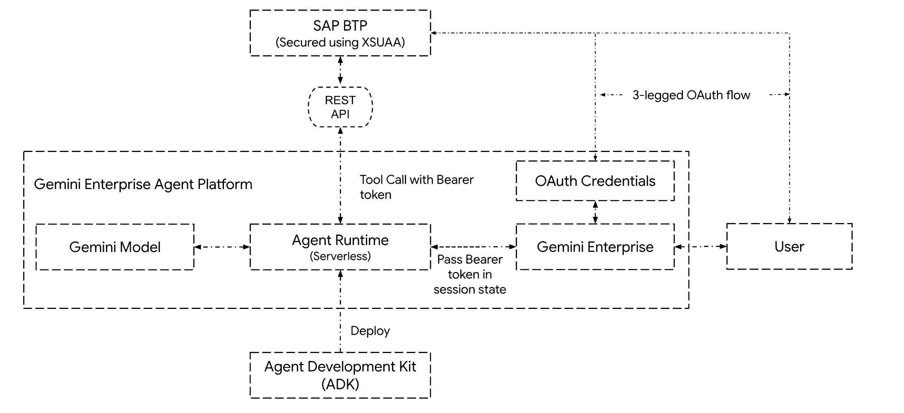
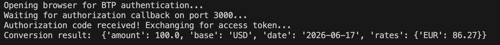
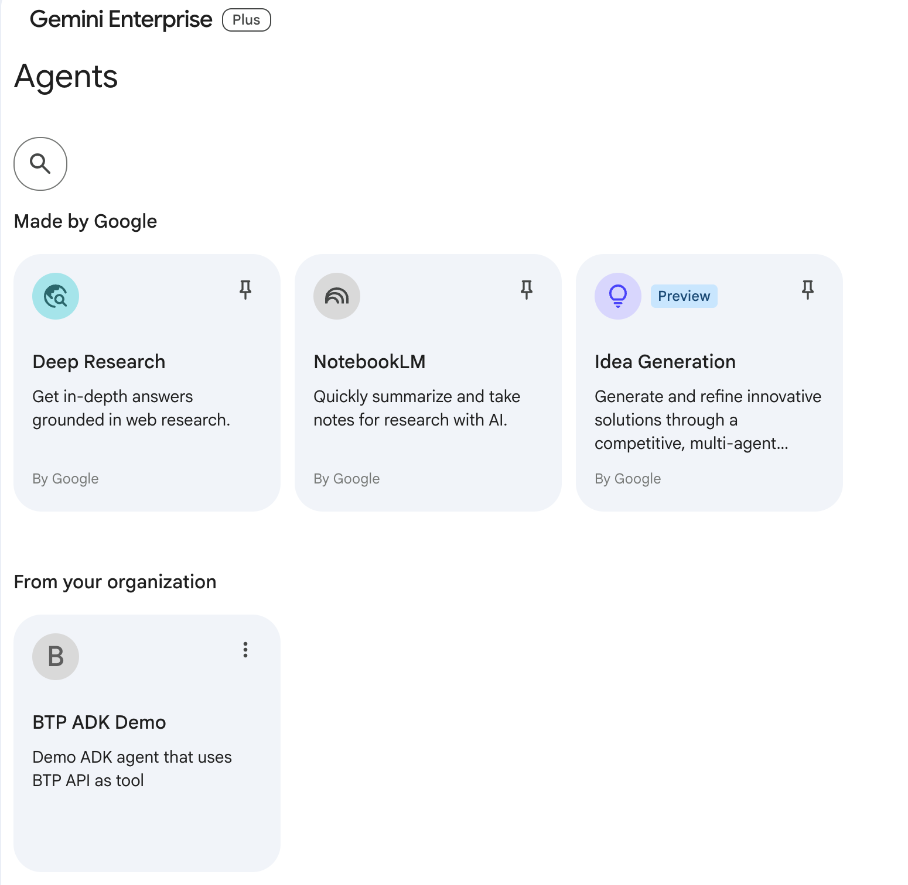
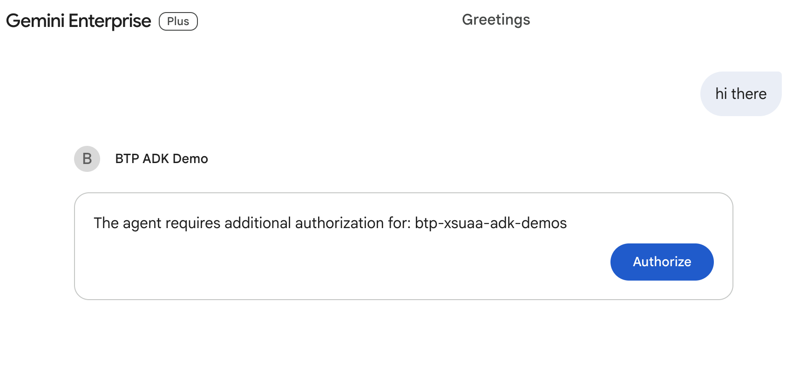
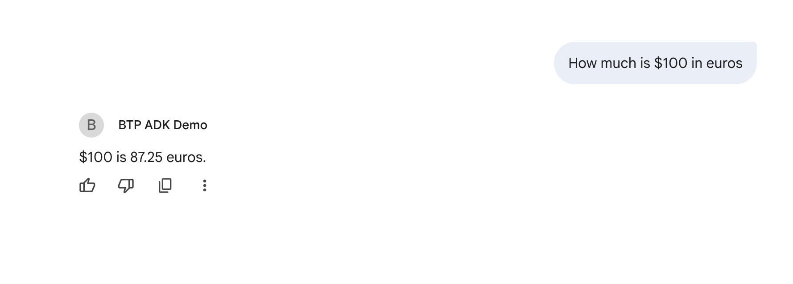

# Tutorial: Building SAP BTP-Powered Secure Agents with Google Cloud Agent Development Kit (ADK)

**Tech Stack**: `Google Cloud ADK`, `Gemini Enterprise`, `Agent Runtime`, `Gemini Models`, `SAP BTP`, `XSUAA`, `Python`  
---

## 1. Introduction

### Objective

Building on our [previous tutorial](../01-adk-btp-simple/README.md), this guide covers securing an **SAP BTP** API using **XSUAA** and accessing it through an **ADK-based** agent deployed to the **Agent Runtime**. You will learn to configure **[Gemini Enterprise](https://docs.cloud.google.com/gemini/enterprise/docs)** to handle the 3-legged OAuth flow out of the box, allowing the agent to securely authenticate and consume the BTP API using the provided OAuth tokens.

### Goals

* Create an Authorization and Trust (**XSUAA**) service instance on SAP BTP.
* Secure the currency conversion API deployed earlier with XSUAA authentication.
* Update the **ADK agent** to use bearer tokens to authenticate with the currency conversion API.
* Deploy the updated agent to the **Agent Runtime**.
* Register the ADK agent with **Gemini Enterprise** and configure its authorization details.
* Test the agent using the Gemini Enterprise UI.

---

## 2. Prerequisites & Setup

Before you begin, ensure you have:

* Fully completed the previous tutorial (including its prerequisites) and successfully:
  * Deployed the currency conversion API to your SAP BTP subaccount.
  * Deployed the ADK agent to the Agent Runtime.
  * Tested the agent successfully using the Agent Runtime playground.

### Google Cloud Resources

* Create a [Gemini Enterprise App](https://docs.cloud.google.com/gemini/enterprise/docs/create-app) by following the [Gemini Enterprise Quickstart Guide](https://docs.cloud.google.com/gemini/enterprise/docs/quickstart-gemini-enterprise).

---

## 3. Architecture Overview

The architecture follows the "Brain-Tools-Runtime" pattern introduced in the previous tutorial, with a few additions:

1. When the user accesses the agent for the first time, Gemini Enterprise initiates the 3-legged OAuth flow to obtain access tokens (and refresh tokens).
2. Once valid tokens are obtained, Gemini Enterprise securely stores them and passes the access token to the ADK agent in a state variable.
3. The ADK agent retrieves the access token from the state and uses it for its tool calls.
4. Gemini Enterprise automatically refreshes the access token using the refresh token when required, removing complexity from the agent code.



---

## 4. Building the Agent

> [!NOTE]
> If you haven't completed the previous tutorial, please do so first. The remainder of this document walks you through updating the code and configuration files created there.

### Step 1: Create an XSUAA Service

Create the `xs-security.json` file in the `adk-btp-simple-api` folder to hold the XSUAA configuration:

```shell
cd adk-btp-simple-api
# Make sure you are in the adk-btp-simple-api folder
touch xs-security.json
```

Open `xs-security.json` and paste the JSON content from [xs-security.json](./adk-btp-simple-api/xs-security.json). This defines the scope for the API and sets up the OAuth redirection endpoint.

Create an XSUAA service instance in SAP BTP. We name the service `adk-demos`, but you can choose your own name if needed. We will also create a service key to use later for the OAuth flow:

```shell
# Make sure you are in the adk-btp-simple-api folder
# Create XSUAA service
cf create-service xsuaa application adk-demos -c xs-security.json

# Create XSUAA service key
cf create-service-key adk-demos adk-demos-sk

# View the service key created. Note down the clientid, clientsecret and url from the JSON output
cf service-key adk-demos adk-demos-sk
```

### Step 2: Update the API

Open the `manifest.yml` file and paste the YAML content from [manifest.yml](./adk-btp-simple-api/manifest.yml). Note that we bind the `adk-demos` XSUAA service to the `currency-conversion-api` service.

Open `main.py` in the `adk-btp-simple-api` folder and paste the Python code from [main.py](./adk-btp-simple-api/main.py). In this version, we verify that incoming calls are authenticated before responding, while still allowing unauthenticated access to the OpenAPI specification (`/apispec.json`).

### Step 3: Deploy the API to SAP BTP

Open the `requirements.txt` file and paste the dependencies list from [requirements.txt](./adk-btp-simple-api/requirements.txt).

Then, deploy the API to SAP BTP using `cf push`:

```shell
# Make sure you are in the adk-btp-simple-api folder
# Log in to SAP BTP if you aren't already
cf login

cf push
```

If the deployment is successful, you will see an output similar to the screenshot below. The API is now available for consumption at the URL shown in the `routes` section.


### Step 4: Test the Currency Conversion API

Access the API through your browser using the link below, replacing the placeholder domain with your deployed API's route:
`https://currency-conversion-api-<xxxxxxx>.cfapps.us30.hana.ondemand.com/convert?amount=100&from_currency=usd&to_currency=eur`

You should see an "Internal Server Error" or "Unauthorized" response because the request lacks an access token. However, the `/apispec.json` endpoint should resolve successfully since it is not gated behind authentication.

To test the API properly, we need to request an access token from the XSUAA service and attach it to the request. Let's create a temporary test project to verify the API with authentication:

```shell
cd ..
# Make sure you are in the parent folder of the project (the parent of the adk-btp-simple-api folder)
uv init adk-btp-simple-api-test
cd adk-btp-simple-api-test
uv venv
source .venv/bin/activate
uv add requests
```

Open `adk-btp-simple-api-test/main.py` and paste the contents from [main.py](./adk-btp-simple-api-test/main.py).

Retrieve the Client ID, Client Secret, and token URL from the XSUAA service key you created in Step 1. Export them as environment variables in your terminal to run the test script:

```shell
# Make sure you are in the adk-btp-simple-api-test folder
# View the service key created. Note down the clientid, clientsecret and url from the JSON output
cf service-key adk-demos adk-demos-sk

# Replace these values with your specific service key details
export XSUAA_URL='https://xxxx.authentication.us30.hana.ondemand.com'
export CLIENT_ID='sb-currency-conversion-api!xxxx'
export CLIENT_SECRET='f9b5e754-a6e9-xxxxxxxx'
export CURRENCY_CONVERSION_API_URL='https://currency-conversion-api-XXXXXX.cfapps.us30.hana.ondemand.com'

# Run the test
uv run main.py
```

This opens a browser window to start the OAuth flow. Once you authenticate against SAP BTP, the script will fetch and output the conversion results (the actual exchange rate will vary):



### Step 5: Create the Agent Authentication Resource in Gemini Enterprise

The agent created in the previous tutorial cannot access the secure API without an OAuth access token. In our architecture, the client (Gemini Enterprise) manages user authentication and securely passes the access token to the agent.

If you haven't set up Gemini Enterprise yet, please complete the [Gemini Enterprise Quickstart Guide](https://docs.cloud.google.com/gemini/enterprise/docs/quickstart-gemini-enterprise) first. Next, create an [Agent Authentication Resource](https://docs.cloud.google.com/gemini/enterprise/docs/register-and-manage-an-adk-agent#register-an-adk-agent) using the command below.

> [!IMPORTANT]
> Before running the command, replace the placeholders with your setup details:
> * **`PROJECT_ID`**: Your Google Cloud project ID (e.g., `my-demo-project`).
> * **`PROJECT_NUMBER`**: Your Google Cloud project number (e.g., `1234567890`).
> * **`ENDPOINT_LOCATION` / `LOCATION`**: The region for your Gemini Enterprise app (`global`, `us`, or `eu`).
> * **`AUTH_ID`**: A unique identifier for this authentication configuration (e.g., `btp-xsuaa-adk-demos`).
> * **`OAUTH_CLIENT_ID`**: The `clientid` from your BTP XSUAA service key.
> * **`OAUTH_CLIENT_SECRET`**: The `clientsecret` from your BTP XSUAA service key.
> * **`OAUTH_AUTH_URI`**: The authorization endpoint from your BTP XSUAA service key (e.g., `https://xxxxxxx.authentication.us30.hana.ondemand.com/oauth/authorize`).
> * **`OAUTH_TOKEN_URI`**: The token endpoint from your BTP XSUAA service key (e.g., `https://xxxxxxx.authentication.us30.hana.ondemand.com/oauth/token`).

```shell
curl -X POST \
   -H "Authorization: Bearer $(gcloud auth application-default print-access-token)" \
   -H "Content-Type: application/json" \
   -H "X-Goog-User-Project: PROJECT_ID" \
   "https://ENDPOINT_LOCATION-discoveryengine.googleapis.com/v1alpha/projects/PROJECT_NUMBER/locations/LOCATION/authorizations?authorizationId=AUTH_ID" \
   -d '{
      "name": "projects/PROJECT_NUMBER/locations/LOCATION/authorizations/AUTH_ID",
      "serverSideOauth2": {
         "clientId": "OAUTH_CLIENT_ID",
         "clientSecret": "OAUTH_CLIENT_SECRET",
         "authorizationUri": "OAUTH_AUTH_URI?scope=uaa.user&response_type=code&access_type=offline&prompt=consent",
         "tokenUri": "OAUTH_TOKEN_URI"
      }
   }'
```

### Step 6: Register the ADK Agent with Gemini Enterprise

Now, register your ADK agent with Gemini Enterprise to enable interacting with it through the Gemini Enterprise app UI.

> [!IMPORTANT]
> Before running the command, replace the placeholders with your setup details:
> * **`PROJECT_ID`**: Your Google Cloud project ID.
> * **`PROJECT_NUMBER`**: Your Google Cloud project number.
> * **`ENDPOINT_LOCATION` / `LOCATION`**: The region for your Gemini Enterprise app (`global`, `us`, or `eu`).
> * **`APP_ID`**: The ID of your Gemini Enterprise App.
> * **`AGENT_RUNTIME_LOCATION`**: The Google Cloud region where your Agent Runtime is deployed (e.g., `us-central1`).
> * **`AGENT_RUNTIME_RESOURCE_ID`**: The ID of your deployed Agent Runtime resource (e.g., `6920737952xxxxxx`).
> * **`AUTH_ID`**: The authentication configuration ID from Step 5 (e.g., `btp-xsuaa-adk-demos`).

```shell
curl -X POST \
      -H "Authorization: Bearer $(gcloud auth application-default print-access-token)" \
      -H "Content-Type: application/json" \
      -H "X-Goog-User-Project: PROJECT_ID" \
      "https://ENDPOINT_LOCATION-discoveryengine.googleapis.com/v1alpha/projects/PROJECT_NUMBER/locations/LOCATION/collections/default_collection/engines/APP_ID/assistants/default_assistant/agents" \
      -d '{
         "displayName": "BTP ADK Demo",
         "description": "Demo ADK agent that uses BTP API as tool",
         "adkAgentDefinition": {
            "provisionedReasoningEngine": {
               "reasoningEngine": "projects/PROJECT_ID/locations/AGENT_RUNTIME_LOCATION/reasoningEngines/AGENT_RUNTIME_RESOURCE_ID"
            }
         },
         "authorizationConfig": {
            "toolAuthorizations": [
               "projects/PROJECT_NUMBER/locations/LOCATION/authorizations/AUTH_ID"
            ]
         }
      }'
```

### Step 7: Update the Agent Code and Redeploy

When a user interacts with the agent for the first time, Gemini Enterprise initiates the 3-legged OAuth flow to request consent and retrieve access tokens from SAP BTP. These access tokens are passed to the agent in a state variable named after the authentication resource created in Step 5 (e.g., `btp-xsuaa-adk-demos`). We must update the agent code to retrieve this token and use it for tool authentication.

Open `agent.py` in the `adk-btp-simple-agent/app` folder and update it with the code from [agent.py](./adk-btp-simple-agent/app/agent.py). Notice how we retrieve the access token from the state variable and inject it into the `OpenAPIToolset` using the `get_auth_headers` function.

Redeploy the agent to the Agent Runtime using `agents-cli deploy`. This command packages the application code, builds a container image, and deploys it to the serverless runtime environment. The deployment process may take several minutes. Make sure you run this from your project root folder (`adk-btp-simple-agent`).

> [!IMPORTANT]
> Replace the placeholders with your setup details:
> * **`YOUR_PROJECT_ID`**: Your Google Cloud project ID.
> * **`YOUR_GOOGLE_CLOUD_REGION`**: Your Google Cloud region (e.g., `us-central1`).

```shell
PROJECT_ID=YOUR_PROJECT_ID
LOCATION_ID=YOUR_GOOGLE_CLOUD_REGION

uv lock

# Make sure you are in the adk-btp-simple-agent folder
agents-cli deploy \
        --project=$PROJECT_ID \
        --region=$LOCATION_ID
```

A successful deployment will output details similar to the following:


---

## 5. Testing the Agent with Gemini Enterprise

Launch your Gemini Enterprise App. Under the **Agents** tab, you should see a card for **BTP ADK Demo** (registered with Gemini Enterprise in Step 6):



Accessing the agent for the first time prompts Gemini Enterprise to request OAuth authorization:

  

Clicking **Authorize** redirects you to the SAP BTP login page to authenticate your account:


Once successfully logged in, you can start conversing with the agent, which can now query the secure API:



---

## 6. Summary

In this tutorial, you learned how to:

- Secure your API using **SAP BTP XSUAA**.
- Build a production-ready AI agent using the **Google Cloud Agent Development Kit (ADK)** and securely consume APIs.
- Package and deploy the agent to the fully managed **Agent Runtime** for enterprise-grade scalability.
- Register the agent with **Gemini Enterprise** and interact with it through the Gemini Enterprise UI.
- Use **Authentication resources** in Gemini Enterprise to abstract OAuth authentication away from agent logic.

---

## 7. Resources

* [Google Cloud Agent Development Kit](https://google.github.io/adk-docs/)  
* [Gemini Enterprise Agent Platform - Agent Runtime](https://docs.cloud.google.com/gemini-enterprise-agent-platform/build/runtime)  
* [Generative AI on Gemini Enterprise Agent Platform](https://docs.cloud.google.com/vertex-ai/generative-ai/docs/learn/overview)
